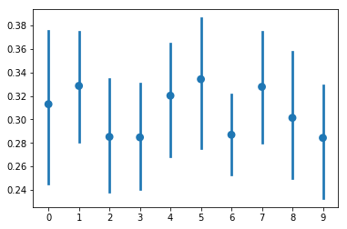
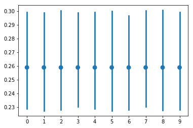

# Lab6
A visual Evaluation of clustering using silhouette_score
* Silhouette_score is a measure of:
	* Cohesion: How related elements in a cluster are.
	* Sepration: The difference between indiviual clusters.
High Silhouette_score indicate good Cohesion and Sepration

## Point plot of Silhouette_score of KNN clusters of size[2-11]

## Point plot of Silhouette_score of Agglomerative clusters of size[2-11]
	

See file Clustering and Visualisation.ipynb
